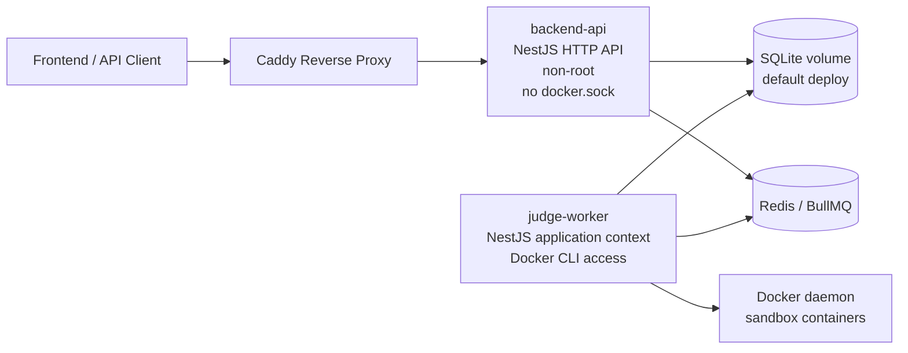
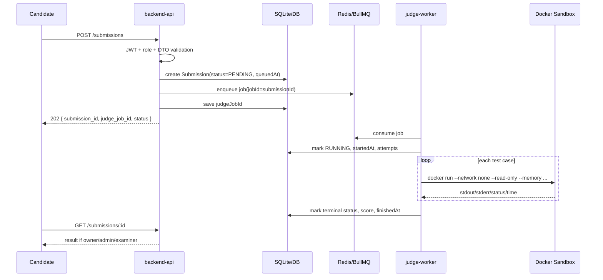
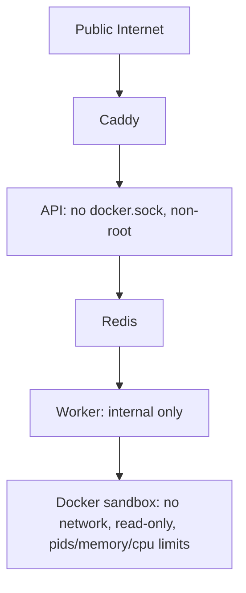

# Architecture Overview

本文件描述目前實作完成的可擴展 code judge backend 架構，重點是 API 與 judge worker 分離、durable queue、可觀測性、測試驗證與部署邊界。

## 1. 架構目標

| 目標                        | 設計                                                                                          |
| --------------------------- | --------------------------------------------------------------------------------------------- |
| API 可水平擴充              | API 只處理 HTTP、驗證、DB 寫入與 enqueue，不直接跑使用者程式                                  |
| Judge job 不因 API 重啟遺失 | production 使用 Redis/BullMQ 持久化 queue                                                     |
| 降低 Docker socket 風險     | 只有 `judge-worker` service 掛 Docker socket，`backend-api` 不掛 socket 且以非 root 執行      |
| 可觀測性                    | 每個 HTTP response 帶 `x-request-id`，錯誤 response 含 `requestId`，queue job 含 `judgeJobId` |
| 可測試                      | unit 測 processor/recovery，e2e 測 auth matrix、submission lifecycle、health readiness        |
| 可部署                      | Docker Compose 包含 API、worker、Redis、Caddy、health check、smoke test                       |

## 2. Container 架構

### Container responsibility

| Service        | 責任                                                                    | 不應負責                         |
| -------------- | ----------------------------------------------------------------------- | -------------------------------- |
| `backend-api`  | Auth/RBAC、API validation、建立 submission、enqueue judge job、查詢結果 | 執行使用者程式、掛 Docker socket |
| `redis`        | BullMQ durable queue、job retry state                                   | 業務資料                         |
| `judge-worker` | 消費 judge job、啟 sandbox container、寫回 submission result            | 公開 HTTP API                    |
| `caddy`        | TLS / reverse proxy                                                     | app business logic               |

## 3. Submission 資料流

## 4. Module Boundary

| Module        | Owns                                                              | Should not do                        |
| ------------- | ----------------------------------------------------------------- | ------------------------------------ |
| `auth`        | login/signup/JWT/RBAC constants                                   | DB schema migration                  |
| `submissions` | HTTP submit/poll API、submission persistence、enqueue             | run Docker, loop test cases          |
| `judge`       | queue producer、job processor、worker consumer、sandbox execution | user-facing submission authorization |
| `problems`    | problem CRUD、test case authoring                                 | judge execution                      |
| `health`      | liveness/readiness/stats                                          | business mutation                    |
| `common`      | request id、logging、exception filter、pagination helper          | domain rules                         |

## 5. Queue Modes

| Mode     | Env                                      | 用途                                               |
| -------- | ---------------------------------------- | -------------------------------------------------- |
| `inline` | `JUDGE_QUEUE_DRIVER=inline`              | local unit/e2e 測試，避免測試環境依賴 Redis/worker |
| `redis`  | `JUDGE_QUEUE_DRIVER=redis` + `REDIS_URL` | production / docker compose durable queue          |

Production 會由 env validation 強制使用 `redis`，避免正式部署不小心以 inline 模式運作。

## 6. Reliability Controls

- BullMQ job `attempts` 預設 3 次，可用 `JUDGE_JOB_ATTEMPTS` 調整。
- Job id 使用 `submissionId`，避免重複 enqueue 造成重複執行。
- `JudgeRecoveryService` 啟動時會重新排入卡在 `PENDING/RUNNING` 且超過 `JUDGE_STUCK_AFTER_SECONDS` 的 submission。
- Submission 增加 `judgeJobId`、`queuedAt`、`startedAt`、`finishedAt`、`attempts`、`lastError`，方便追蹤與除錯。

## 7. Health Probes

| Endpoint                   | 用途                          | 檢查                                                        |
| -------------------------- | ----------------------------- | ----------------------------------------------------------- |
| `GET /api/v1/health/live`  | liveness                      | process 是否可回應                                          |
| `GET /api/v1/health/ready` | readiness                     | DB + judge queue                                            |
| `GET /api/v1/health`       | backward compatible readiness | 同 `/ready`                                                 |
| `GET /api/v1/health/stats` | dashboard/stats               | DB latency、submission counts、queue stats、process metrics |

## 8. Security Boundary

已降低但尚未完全消除的風險：

- Worker 仍需 Docker daemon access。這是 Compose 部署下的務實折衷。
- 若要更高安全等級，下一步應改成 rootless Docker、gVisor、Firecracker 或獨立 runner host。

## 9. Test Strategy

| Layer       | Coverage                                                                                                              |
| ----------- | --------------------------------------------------------------------------------------------------------------------- |
| Unit        | auth、RBAC、problem analytics、submission queue enqueue、judge processor、recovery、health                            |
| Integration | real SQLite migrations + seed，auth/users/problems/leaderboard                                                        |
| E2E         | auth flows、authorization matrix、submission lifecycle、health probes、internal API、error schema                     |
| CI          | lint check、format check、coverage threshold、migration status、build、worker entrypoint、docker compose health smoke |

## 10. Operational Runbook Summary

1. Deploy with `npm run deploy`.
2. Check `GET /api/v1/health/ready`.
3. Watch `docker compose logs -f backend-api judge-worker redis`.
4. If submissions remain `PENDING/RUNNING`, inspect `judgeJobId`, `lastError`, worker logs and Redis health.
5. Roll back by deploying the previous image/commit and running `docker compose up -d --build`; do not run `SEED_DB=true` on production data.
