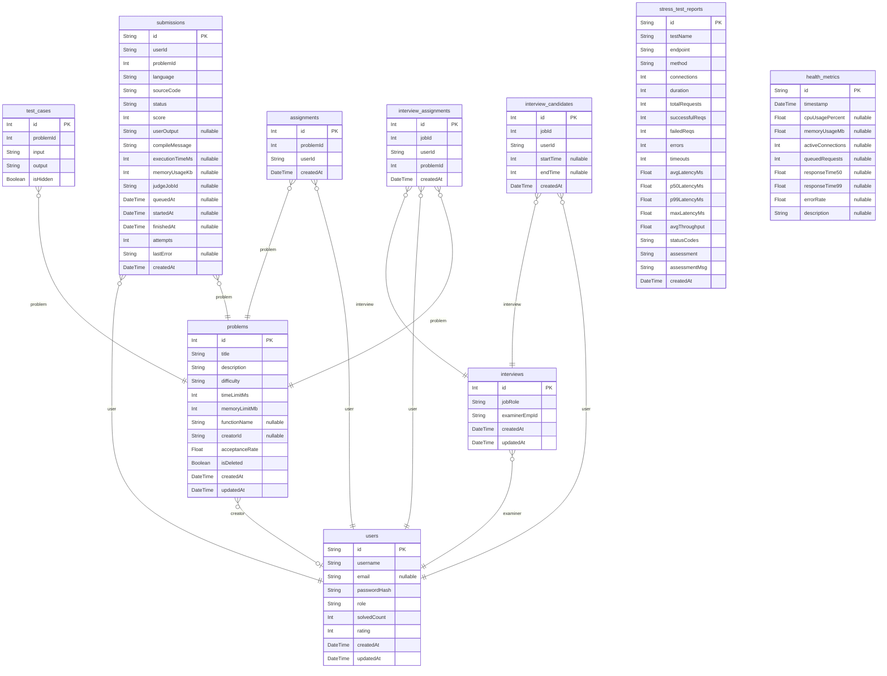

```mermaid
erDiagram

  "users" {
    String id "PK"
    String username
    String email "nullable"
    String passwordHash
    String role
    Int solvedCount
    Int rating
    DateTime createdAt
    DateTime updatedAt
    }


  "problems" {
    Int id "PK"
    String title
    String description
    String difficulty
    Int timeLimitMs
    Int memoryLimitMb
    String functionName "nullable"
    String creatorId "nullable"
    Float acceptanceRate
    Boolean isDeleted
    DateTime createdAt
    DateTime updatedAt
    }


  "test_cases" {
    Int id "PK"
    Int problemId
    String input
    String output
    Boolean isHidden
    }


  "submissions" {
    String id "PK"
    String userId
    Int problemId
    String language
    String sourceCode
    String status
    Int score
    String userOutput "nullable"
    String compileMessage
    Int executionTimeMs "nullable"
    Int memoryUsageKb "nullable"
    String judgeJobId "nullable"
    DateTime queuedAt "nullable"
    DateTime startedAt "nullable"
    DateTime finishedAt "nullable"
    Int attempts
    String lastError "nullable"
    DateTime createdAt
    }


  "assignments" {
    Int id "PK"
    Int problemId
    String userId
    DateTime createdAt
    }


  "interviews" {
    Int id "PK"
    String jobRole
    String examinerEmpId
    DateTime createdAt
    DateTime updatedAt
    }


  "interview_candidates" {
    Int id "PK"
    Int jobId
    String userId
    Int startTime "nullable"
    Int endTime "nullable"
    DateTime createdAt
    }


  "interview_assignments" {
    Int id "PK"
    Int jobId
    String userId
    Int problemId
    DateTime createdAt
    }


  "stress_test_reports" {
    String id "PK"
    String testName
    String endpoint
    String method
    Int connections
    Int duration
    Int totalRequests
    Int successfulReqs
    Int failedReqs
    Int errors
    Int timeouts
    Float avgLatencyMs
    Float p50LatencyMs
    Float p99LatencyMs
    Float maxLatencyMs
    Float avgThroughput
    String statusCodes
    String assessment
    String assessmentMsg
    DateTime createdAt
    }


  "health_metrics" {
    String id "PK"
    DateTime timestamp
    Float cpuUsagePercent "nullable"
    Float memoryUsageMb "nullable"
    Int activeConnections "nullable"
    Int queuedRequests "nullable"
    Float responseTime50 "nullable"
    Float responseTime99 "nullable"
    Float errorRate "nullable"
    String description "nullable"
    }

    "problems" }o--|o users : "creator"
    "test_cases" }o--|| problems : "problem"
    "submissions" }o--|| users : "user"
    "submissions" }o--|| problems : "problem"
    "assignments" }o--|| problems : "problem"
    "assignments" }o--|| users : "user"
    "interviews" }o--|| users : "examiner"
    "interview_candidates" }o--|| interviews : "interview"
    "interview_candidates" }o--|| users : "user"
    "interview_assignments" }o--|| interviews : "interview"
    "interview_assignments" }o--|| users : "user"
    "interview_assignments" }o--|| problems : "problem"
```
