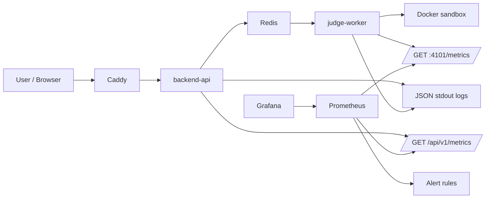

# Observability

本專案的 observability 目標不是只看 log，而是能回答三個問題：

1. What is broken?
2. Why is it broken?
3. When did it start?

目前可交付的 o11y stack 包含 request correlation、structured logs、health probes、Prometheus metrics、Grafana dashboard、Prometheus alert rules 與 SLI/SLO 文件。Distributed tracing、centralized log storage 與 profiling 仍列為後續強化項目。

## 1. Stack



| Layer       | Implementation                                   | Purpose                                               |
| ----------- | ------------------------------------------------ | ----------------------------------------------------- |
| Correlation | `x-request-id`, `judgeJobId`, `submissionId`     | 串起 frontend report、HTTP log、worker log 與 DB 狀態 |
| Logs        | JSON event logs to stdout                        | 回答發生什麼事、哪個 request/job 失敗                 |
| Health      | `/health/live`, `/health/ready`, `/health/stats` | liveness、readiness、人工排查                         |
| Metrics     | `/api/v1/metrics` with `prom-client`             | time-series 指標，供 Prometheus scrape                |
| Dashboard   | Grafana provisioning                             | 視覺化 RED、queue、DB、Node process metrics           |
| Alerts      | Prometheus alert rules                           | 5xx、latency、DB down、queue backlog、worker failures |

## 2. How To View O11y

啟動整組服務：

```bash
docker compose up -d --build
```

本機入口：

| Tool           | URL                                                       | Notes                                                   |
| -------------- | --------------------------------------------------------- | ------------------------------------------------------- |
| API health     | `http://localhost:4100/api/v1/health/ready`               | DB + Redis/BullMQ readiness                             |
| API metrics    | `http://localhost:4100/api/v1/metrics`                    | Prometheus text format                                  |
| Worker metrics | `http://judge-worker:4101/metrics` inside compose network | Scraped by Prometheus as `code-judge-worker`            |
| Prometheus     | `http://localhost:9090`                                   | Query metrics and alerts                                |
| Grafana        | `http://localhost:3001`                                   | Default login `admin` / `admin` unless env overrides it |

快速檢查 metrics：

```bash
curl http://localhost:4100/api/v1/metrics | grep code_judge
```

產生一些 HTTP traffic：

```bash
curl http://localhost:4100/api/v1/health/live
curl http://localhost:4100/api/v1/problems
curl http://localhost:4100/api/v1/metrics | grep code_judge_http_requests_total
```

Grafana 會自動載入 `Code Judge / Code Judge Observability` dashboard。Prometheus 會自動載入 `observability/prometheus/alerts/code-judge.rules.yml`。

## 3. Black-box And White-box

| View      | Current coverage                                                                       | What it tells us                                                             |
| --------- | -------------------------------------------------------------------------------------- | ---------------------------------------------------------------------------- |
| Black-box | `GET /api/v1/health/live`, `GET /api/v1/health/ready`, optional external uptime checks | 使用者視角是否能連到服務、核心 dependency 是否可用                           |
| White-box | Prometheus metrics from API internals                                                  | API latency/errors、DB latency/up、queue depth、worker failures、Node memory |

建議 production 再加外部 synthetic checks：

- Login smoke check
- `GET /problems`
- `POST /judge/run` with a small sample
- `GET /submissions/:id` lifecycle check

## 4. Metrics

Metrics endpoints:

```txt
GET /api/v1/metrics     # API process
GET :4101/metrics       # judge worker process, scraped inside Docker network
```

主要指標：

| Methodology                 | Metric                                                                               | Meaning                                        |
| --------------------------- | ------------------------------------------------------------------------------------ | ---------------------------------------------- |
| RED - Rate                  | `code_judge_http_requests_total`                                                     | HTTP request count by method, route and status |
| RED - Errors                | `code_judge_http_requests_total{status_code=~"5.."}`                                 | Platform-side HTTP failures                    |
| RED - Duration              | `code_judge_http_request_duration_seconds`                                           | HTTP latency histogram for P50/P95/P99         |
| Golden Signals - Saturation | `code_judge_judge_queue_jobs{state="waiting"}`                                       | Judge backlog                                  |
| White-box DB                | `code_judge_database_up`                                                             | DB health check result                         |
| White-box DB                | `code_judge_database_latency_seconds`                                                | DB health check latency                        |
| Judge                       | `code_judge_judge_jobs_total`                                                        | Worker job lifecycle events                    |
| Judge                       | `code_judge_judge_job_duration_seconds`                                              | Worker job duration histogram                  |
| Product state               | `code_judge_submissions_total`                                                       | Submission counts by judge status              |
| Node process                | `code_judge_process_resident_memory_bytes`, `code_judge_nodejs_heap_size_used_bytes` | Runtime memory                                 |

Tail latency should use percentiles, not only averages:

```promql
histogram_quantile(
  0.95,
  sum(rate(code_judge_http_request_duration_seconds_bucket[5m])) by (le)
)
```

## 5. Alerts

Alert rules live in:

```txt
observability/prometheus/alerts/code-judge.rules.yml
```

| Alert                           | Condition                         | Why it matters                              |
| ------------------------------- | --------------------------------- | ------------------------------------------- |
| `CodeJudgeHigh5xxRate`          | 5xx rate > 5% for 5m              | Users are seeing platform failures          |
| `CodeJudgeHighP95Latency`       | P95 HTTP latency > 500ms for 10m  | API SLO is being missed                     |
| `CodeJudgeDatabaseDown`         | `database_up == 0` for 1m         | Core persistence dependency unavailable     |
| `CodeJudgeQueueBacklog`         | waiting judge jobs > 100 for 5m   | Submissions are accumulating                |
| `CodeJudgeHighJudgeFailureRate` | worker failure rate > 10% for 10m | Sandbox, worker or dependency failure spike |

Prometheus UI:

```txt
http://localhost:9090/alerts
```

## 6. SLI / SLO / SLA

These are internal SLOs. They are not a customer-facing SLA unless explicitly published.

| SLI              | Formula / Query Direction                            | SLO                                       |
| ---------------- | ---------------------------------------------------- | ----------------------------------------- |
| API availability | successful non-4xx requests / total non-4xx requests | 99.9% monthly                             |
| API latency      | P95 of `code_judge_http_request_duration_seconds`    | < 500ms for 95% of requests               |
| DB health        | `code_judge_database_up` over time                   | 99.9% monthly                             |
| Judge completion | terminal platform-completed jobs / submitted jobs    | 99% complete within 60s                   |
| Queue freshness  | waiting jobs and oldest waiting age                  | backlog under 100 jobs during normal load |

Important classification rule:

- User-code outcomes such as `WRONG_ANSWER`, normal `COMPILE_ERROR`, `TIME_LIMIT_EXCEEDED` and `RUNTIME_ERROR` are product results, not automatically platform incidents.
- Platform errors are API 5xx, DB/Redis unavailable, worker crash, sandbox infrastructure failure, stuck submissions and excessive queue backlog.

Error budget examples:

| SLO                                | Monthly error budget                                                     |
| ---------------------------------- | ------------------------------------------------------------------------ |
| 99.9% availability                 | about 43.2 minutes unavailable per 30 days                               |
| 99% judge completion within target | 1% of judge submissions may exceed target before the budget is exhausted |

## 7. Logs

Current log pattern:

- HTTP request completion logs are structured JSON.
- 5xx errors are structured JSON and include `requestId`.
- Judge worker logs include job lifecycle events.

Useful fields:

| Field          | Purpose                                                                                      |
| -------------- | -------------------------------------------------------------------------------------------- |
| `timestamp`    | Provided by runtime/container log timestamp                                                  |
| `event`        | `http_request`, `http_error`, `judge_job_started`, `judge_job_completed`, `judge_job_failed` |
| `requestId`    | Correlates frontend report and backend logs                                                  |
| `jobId`        | Correlates BullMQ job and submission                                                         |
| `submissionId` | Correlates product state and worker execution                                                |
| `statusCode`   | HTTP outcome                                                                                 |
| `durationMs`   | Request latency                                                                              |

### 7.1 集中式日誌方案：ELK (Elasticsearch + Kibana + Filebeat) 整合

目前本機日誌僅輸出至 stdout/container logs。若要升級為生產規格的集中式日誌，可採用以下 ELK 整合方案，讓所有日誌可於 Kibana 中進行全文檢索與 Correlation ID 追蹤。

#### Step 1: 新增 Filebeat 配置 (`observability/filebeat/filebeat.yml`)

在專案中建立 Filebeat 設定檔，用以收集容器日誌並送至 Elasticsearch：

```yaml
filebeat.inputs:
  - type: container
    paths:
      - '/var/lib/docker/containers/*/*.log'

output.elasticsearch:
  hosts: ['elasticsearch:9200']

setup.kibana:
  host: 'kibana:5601'
```

#### Step 2: 於 `docker-compose.yml` 部署 ELK 服務

```yaml
services:
  # ... 現有服務 ...

  elasticsearch:
    image: docker.elastic.co/elasticsearch/elasticsearch:8.13.4
    container_name: code-judge-elasticsearch
    restart: unless-stopped
    environment:
      - discovery.type=single-node
      - xpack.security.enabled=false
      - 'ES_JAVA_OPTS=-Xms512m -Xmx512m'
    ports:
      - '9200:9200'
    volumes:
      - elasticsearch_data:/usr/share/elasticsearch/data

  kibana:
    image: docker.elastic.co/kibana/kibana:8.13.4
    container_name: code-judge-kibana
    restart: unless-stopped
    ports:
      - '5601:5601'
    environment:
      - ELASTICSEARCH_HOSTS=http://elasticsearch:9200
      - SERVER_BASEPATH=/kibana
      - SERVER_REWRITEBASEPATH=true
    depends_on:
      - elasticsearch

  filebeat:
    image: docker.elastic.co/beats/filebeat:8.13.4
    container_name: code-judge-filebeat
    restart: unless-stopped
    user: root
    volumes:
      - /var/lib/docker/containers:/var/lib/docker/containers:ro
      - /var/run/docker.sock:/var/run/docker.sock:ro
      - ./observability/filebeat/filebeat.yml:/usr/share/filebeat/filebeat.yml:ro
    depends_on:
      - elasticsearch

volumes:
  # ... 現有 volumes ...
  elasticsearch_data:
```

#### Step 3: Caddy 統一路由與反向代理

為了使用單一域名或 localhost 的子路徑存取所有觀測工具，需修改 `Caddyfile` 並設定對應的環境變數：

##### 1. 修改 `Caddyfile`：

```caddy
{$DOMAIN_NAME:localhost} {
    # Observability 路由代理
    reverse_proxy /grafana* grafana:3000
    reverse_proxy /kibana* kibana:5601
    reverse_proxy /prometheus* prometheus:9090

    # API 預設代理
    reverse_proxy backend-api:4100
}
```

##### 2. 修改 `docker-compose.yml` 中各服務的 subpath 設定：

- **Prometheus** (於 `command` 中加入並更新 `healthcheck`)：
  ```yaml
  command:
    - '--config.file=/etc/prometheus/prometheus.yml'
    - '--storage.tsdb.path=/prometheus'
    - '--storage.tsdb.retention.time=${PROMETHEUS_RETENTION:-15d}'
    - '--web.enable-lifecycle'
    - '--web.external-url=/prometheus/' # 新增此行
  healthcheck:
    test:
      [
        'CMD-SHELL',
        'promtool query instant http://127.0.0.1:9090/prometheus up >/dev/null 2>&1 || exit 1',
      ]
  ```
- **Grafana** (於 `environment` 中加入)：
  ```yaml
  environment:
    GF_SERVER_ROOT_URL: '%(protocol)s://%(domain)s:%(port)s/grafana/'
    GF_SERVER_SERVE_FROM_SUB_PATH: 'true'
  ```
- **Kibana** (於 `environment` 中已於 Step 2 帶入)：
  ```yaml
  environment:
    - SERVER_BASEPATH=/kibana
    - SERVER_REWRITEBASEPATH=true
  ```

---

### 7.2 日誌追蹤與檢索手法 (Tracing via Kibana)

當 ELK 部署完成後，Kibana 將成為統一的日誌檢索點。你可以利用日誌中的 Correlation ID 進行鏈路分析：

1.  **建立 Data View**：
    進入 Kibana (`http://localhost/kibana/` 或 `http://localhost:5601`) $\rightarrow$ Discover $\rightarrow$ 建立 `filebeat-*` Data View (以 `@timestamp` 為時間欄位)。
2.  **追蹤單次請求**：
    在搜尋欄輸入 `message : "YOUR_REQUEST_ID"`，即可橫跨 `backend-api` 與 `judge-worker` 過濾出該次請求的所有相關 JSON 日誌。
3.  **分析判題流程**：
    輸入 `message : "YOUR_SUBMISSION_ID"` 追蹤特定提交案從建立到沙盒評測完成的生命週期。

## 8. Tracing And Profiling

Current state:

- Request id and job id provide correlation.
- Full distributed tracing is not implemented yet.

Recommended next tracing flow:

```txt
POST /submissions
  -> auth span
  -> DB create submission span
  -> BullMQ enqueue span
  -> worker consume span
  -> sandbox run span
  -> DB update result span
  -> GET /submissions/:id polling span
```

Recommended packages for a future tracing PR:

- `@opentelemetry/sdk-node`
- `@opentelemetry/instrumentation-http`
- `@opentelemetry/instrumentation-express`
- `@opentelemetry/exporter-trace-otlp-http`
- Tempo or Jaeger

Profiling is also future work. For this project, the highest-value profiling targets are worker CPU time, sandbox startup overhead, event loop lag, heap growth and Prisma query latency.

## 9. Retention

Current default:

| Data               | Retention                             |
| ------------------ | ------------------------------------- |
| Prometheus metrics | `PROMETHEUS_RETENTION`, default `15d` |
| Grafana dashboards | persisted in `grafana_data` volume    |
| Logs               | container/runtime retention only      |

Recommended production defaults:

- Metrics: 15 to 30 days at raw resolution.
- Logs: 7 to 30 days depending on cost.
- Long-term metrics: downsample to 5m or 1h resolution.
- Alert history: keep at least one incident review cycle.

## 10. Runbook

When an incident happens:

1. Check `GET /api/v1/health/ready`.
2. Check Grafana dashboard for HTTP 5xx, P95/P99 latency, queue backlog and DB up.
3. Check Prometheus alerts at `http://localhost:9090/alerts`.
4. Search logs by `requestId`, `submissionId` or `judgeJobId`.
5. If queue is growing, inspect `code_judge_judge_queue_jobs`, worker logs and Redis health.
6. If DB is down or slow, inspect `code_judge_database_up` and `code_judge_database_latency_seconds`.
7. If only user-code failures increase, classify them separately from platform failures.
